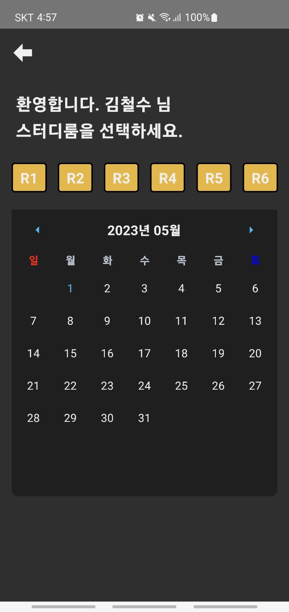
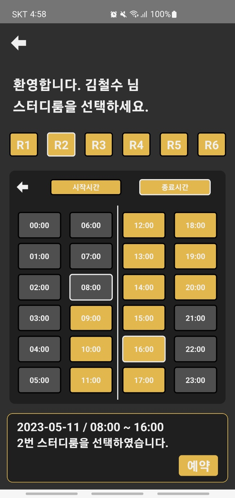
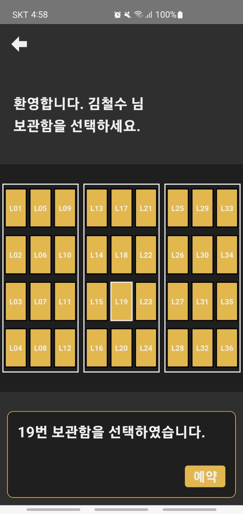

# Kosk-application
스터디카페 키오스크 애플리케이션 토이 프로젝트

## Application Info
React-Native 기반의 스터디카페 키오스크 애플리케이션
- 서버로부터 사용자 정보, 좌석 및 스터디룸 정보를 받아 예약 및 관리 

## Stacks
### Environment
- 
- 

### Development
- 
- 

### Library & Technology stacks
- [react navigation](https://reactnavigation.org)
- [Axios](https://github.com/axios/axios)
- [react-native-vector-icons](https://github.com/oblador/react-native-vector-icons)
- [async-storage](https://react-native-async-storage.github.io/async-storage/)
- [react-native-calendar](https://github.com/wix/react-native-calendars)

## Screens
### 메인 화면

### 좌석 사용

### 스터디룸 예약

#### 날짜 선택

#### 시간 선택

### 사물함 사용

### 이용권 구매

